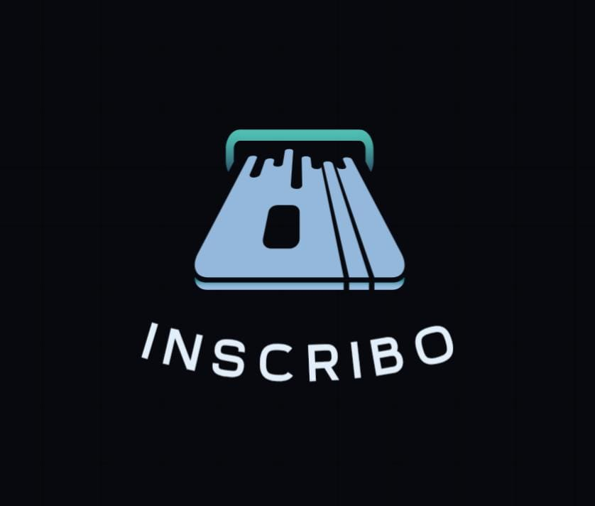

# INSCRIBO
Este proyecto va a tratar de Autumatizar el Registro de Asistencia en el Nivel Superior  con la finalidad de automatizar y agilizar el Registro de Asistencia 
### Paleta de colores 

## Problematica 
Actualmente, muchas instituciones enfrentan dificultades en la gestión del acceso de estudiantes y docentes, ya que dependen de métodos manuales que pueden ser poco eficientes y propensos a errores. Esto puede generar inconvenientes en el registro de asistencia, la supervisión del personal y la seguridad dentro del plantel.

## Propuesta de solución 
El control de acceso en instituciones educativas es un aspecto fundamental para garantizar la seguridad y organización de alumnos, docentes y personal administrativo. En el área de Bachillerato, la implementación de un sistema de Control de Acceso basado en una API con arquitectura Modelo Vista Controlador (MVC) permitirá optimizar el registro de entradas y salidas, asegurando un mejor control y monitoreo en tiempo real.

## Objetivo general 
Diseñar e implementar un Dispositivo IoT para el control de acceso a los laboratorios de la Universidad Tecnologica de Xicotepec de Juarez que registre la puntualidad de los estudiantes y brinde una señal mediante los Leds

## Objetivos especificos
A través de una interfaz web moderna y adaptable, los usuarios podrán visualizar su historial de accesos, recibir notificaciones en caso de eventos irregulares y los administradores podrán generar reportes detallados sobre la actividad dentro del Laboratorio y evaluar el funcionamiento del sistema en condiciones que sean reales
Con la integración de tecnologías como Node.js, React.js, MongoDB/SQL y autenticación mediante JWT, este sistema garantizará una experiencia segura y eficiente tanto para alumnos como para docentes.

## **Lista de tecnologias**
1. #### **Lenguajes de Programación para Desarrollo Backend:**
    Entorno de ejecución para JavaScript en el servidor. Permite construir aplicaciones escalables y eficientes con un modelo basado en eventos y sin bloqueo.
   
2. #### **Bases de datos:**
    Base de datos NoSQL orientada a documentos que almacena datos en formato JSON. Es escalable, flexible y ampliamente utilizada en aplicaciones modernas.

3. #### **Framework para Desarrollo FrontEnd:**
    Biblioteca de JavaScript para construir interfaces de usuario interactivas y reutilizables. Basada en componentes y con un enfoque declarativo que mejora el rendimiento.

### Logo

### Organigrama del Proyecto

## **Diagrama de gant**

## Equipo de Desarrollo

|Integrante|Contacto|Rol|Observaciones|
|------------|--------|---|---|
|Diego Salvador Tecorralco Martínez |[@DiegoTecorralco](https://github.com/DiegoTecorralco)|Lider de Documentación, Backend y Equipo|✅ Revisado y aprobado.|
|Jose Agustín Jímenez Castillo|[@agustin963](https://github.com/agustin963)|Lider de Frontend||✅ Revisado y aprobado|
|Carlos Isaac Fosado Escudero |[@CarlosFosadoo](https://github.com/CarlosFosadoo)|Líder de las base de datos y de documentacion|✅ Revisado y aprobado|
|Marcos Jesús Ríos Duran|[@Marcos-Jesus-Rios-Duran](https://github.com/Marcos-Jesus-Rios-Duran)|Frontend|❌ Falta Revisión|
|Ailton Artiaga Quiroga|[@ArtQuir29](https://github.com/ArtQuir29)|Frontend|❌ Falta Revisión|

